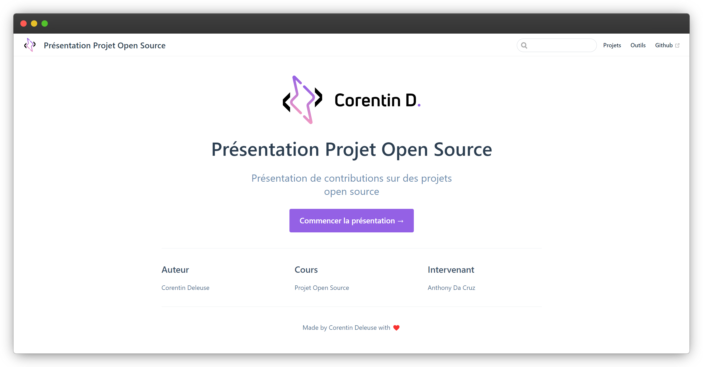

# Projet Open Source

<https://deleusec-open-source.netlify.app/>

Présentation de différentes collaborations sur des projets open source réalisés dans le cadre de notre cours sur les projets open sources.

