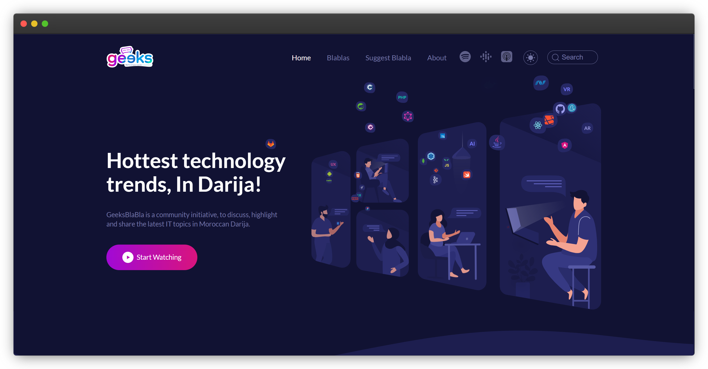
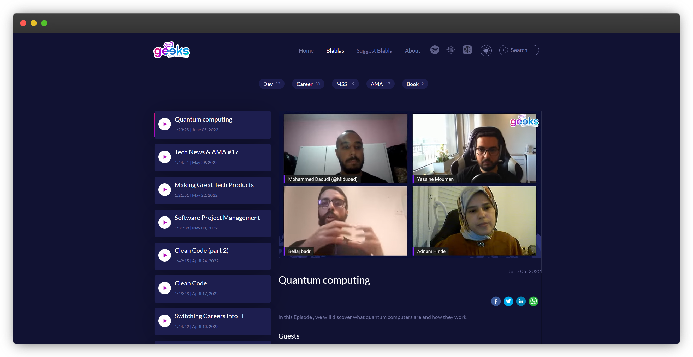
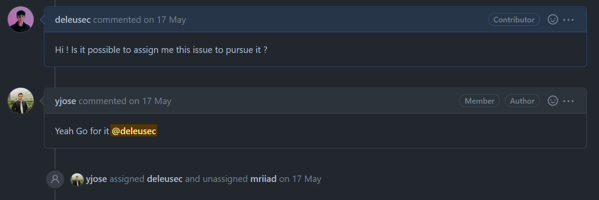

# Geeksblabla 🎧

## Présentation du projet

GeeksBlaBla est une initiative communautaire visant à discuter, mettre en évidence et partager les derniers sujets informatiques en darija marocaine.

C'est une plateforme de webinaires sur lequel sont invités des personnes compétentes et intéressantes qui ne sont pas toujours connues du public afin qu'elles puissent partager leurs expériences.

Ils traitent, à travers des vidéos conférences, les nouveaux sujets d'actualité en abordant cela d'une manière simple et accessible pour tous.

## L'issue traitée

J'ai donc contribué à ce projet en répondant à l'issue suivante :
<https://github.com/DevC-Casa/geeksblabla.com/issues/304>

Il s'agit d'une demande formulée par le créateur du projet lui-même dans laquelle il a donc exprimé le besoin de refaire le footer du site GeeksBlabla. Ce site étant développé principalement en javascript avec la technologie React et le préprocesseur Sass, je pouvais ainsi contribuer facilement au projet et y apporter mon aide dû au fait que je connaissais bien ces technos.

Cette issue avait déjà été assigné à un autre contributeur, mais ce dernier n'ayant pas donné de nouvelles durant plusieurs mois j'ai donc décidé de la reprendre. J'ai tout de même laissé un commentaire s'adressant au créateur du projet afin d'être sûr que cette demande n'avait pas encore été traitée. 
Il m'a très vite répondu en me confirmant que je pouvais bien poursuivre l'issue.

Pour la résolution de cette issue j'ai donc dans un premier temps effectué un fork du projet sur GitHub. Ce qui m'a permis de copier son dépôt afin de pouvoir y apporter mes modifications librement sans toucher au dépôt d'origine.
