# Geeksblabla 🎧

Website url : <https://geeksblabla.com>

GitHub url : <https://github.com/DevC-Casa/geeksblabla.com>

## Présentation du projet

GeeksBlaBla est une initiative communautaire visant à discuter, mettre en évidence et partager les derniers sujets informatiques en darija marocaine.

C'est une plateforme de webinaires sur lequel sont invités des personnes compétentes et intéressantes qui ne sont pas toujours connues du public afin qu'elles puissent partager leurs expériences.

Ils traitent, à travers des vidéos conférences, les nouveaux sujets d'actualité en abordant cela d'une manière simple et accessible pour tous.

## L'issue traitée

J'ai donc contribué à ce projet en répondant à l'issue suivante :
<https://github.com/DevC-Casa/geeksblabla.com/issues/304>

Il s'agit d'une demande formulée par le créateur du projet lui-même dans laquelle il a donc exprimé le besoin de refaire le footer du site GeeksBlabla. Ce site étant développé principalement en javascript avec la technologie React et le préprocesseur Sass, je pouvais ainsi contribuer facilement au projet et y apporter mon aide dû au fait que je connaissais bien ces technos.

Cette issue avait déjà été assigné à un autre contributeur, mais ce dernier n'ayant pas donné de nouvelles durant plusieurs mois j'ai donc décidé de la reprendre. J'ai tout de même laissé un commentaire s'adressant au créateur du projet afin d'être sûr que cette demande n'avait pas encore été traitée. 
Il m'a très vite répondu en me confirmant que je pouvais bien poursuivre l'issue.

## Mise en place du projet
Pour la résolution de cette issue, j'ai donc dans un premier temps effectué un fork du projet sur GitHub. Ce qui m'a permis de copier son dépôt afin de pouvoir y apporter mes modifications librement sans toucher au dépôt d'origine.
Après cela, j'ai cloné cette copie du projet dans un dossier en local et ouvert le projet sur l'éditeur de texte WebStorm. Je me suis alors rendu dans le fichier README.md dans lequel est donné quelques indications concernant le lancement du serveur de développement et la contribution sur ce projet.
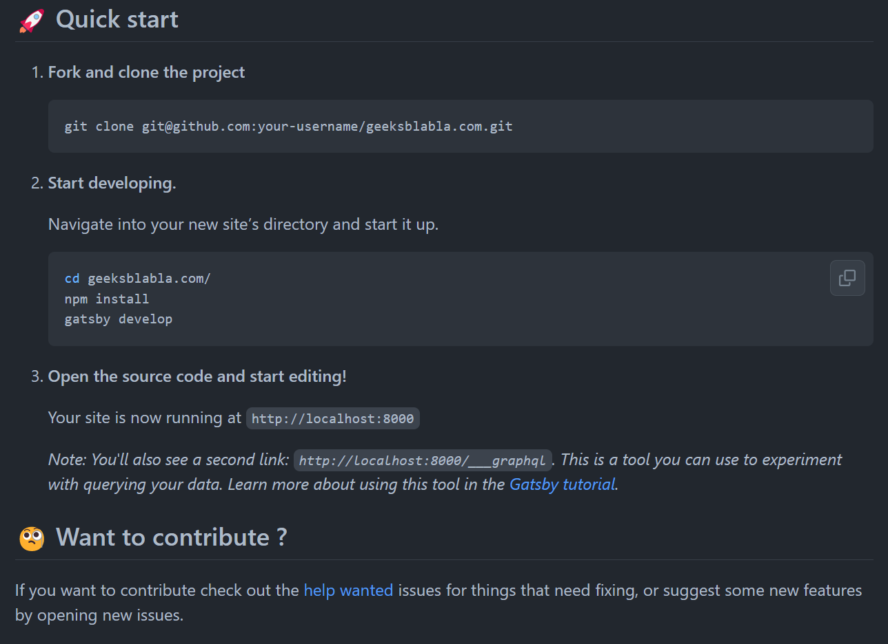

J'ai donc initialisé le gitflow et créé une feature reprenant le nom de l'issue afin d'éviter toutes confusions. Une feature va créer une nouvelle branche en se basant sur la branche develop. Cela permet notamment d'apporter des modifications sans toucher directement à la branche develop et de séparer les différentes issues. 
C'est seulement une fois que le travail sera terminé, que les modifications apportées au projet seront mergés sur les branche develop et main à la fermeture de notre feature.

Il fallait donc ensuite procéder à l'installation des dépendences utilisées pour ce projet. C'est là que l'outil `nvm` (Node Version Manager) se révèle être très utile puisque étant donné que nous sommes sur un projet open source assez vieux, il était donc probable que la version de node du projet soit antérieur à la version actuelle. 
`nvm` nous permet alors d'installer et d'utiliser rapidement différentes versions de node via une ligne de commande. Cela sera donc très pratique dans le cadre de contributions sur des projets open source puisque nous sommes susceptible de tomber sur des projets plus ou moins vieux.

Et enfin, on pourra alors lancer la commande `gatsby develop` pour lancer notre serveur local.
Gatsby est un générateur de site statique open source construit sur Node.js en utilisant React et GraphQL.

## Réalisations

En partant des instructions données par l'auteur de l'issue, je me suis donc engagé dans la conception de ce nouveau pied de page. 
J'ai commencé par réaliser une maquette en partant du modèle donné dans le ticket afin de pouvoir effectuer plusieurs tests de designs et ainsi d'avoir une idée du rendu final.
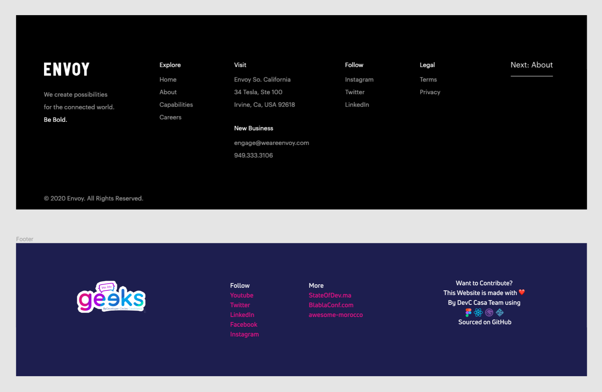

Il a ensuite été nécessaire de construire la structure du footer en modifiant le code HTML du composant Footer en se basant sur la maquette. J'ai également pu reprendre quelques informations qui étaient déjà présente dans le footer d'origine en y ajoutant le nouveau contenu.
Voici donc ci-dessous le code réalisé pour ce footer :
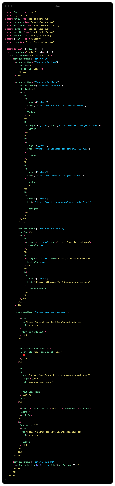

Il était donc nécessaire de modifier le style ce footer afin qu'il corresponde à celui de la maquette. Comme expliqué précédemment ce projet utilise Sass qui sera donc compilé afin de générer le CSS de notre composant.
On importe alors notre feuille de style index.scss se trouvant dans le dossier de notre composant et on peut alors customiser le style de celui-ci. Il a été nécessaire de penser également à l'aspect responsive du footer.
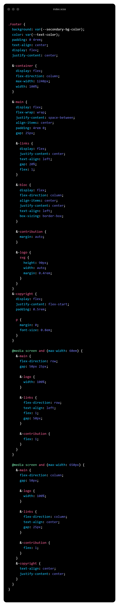

Le footer une fois terminé ressemble donc à ça.

**Version Desktop:**

**Version Tablette:**
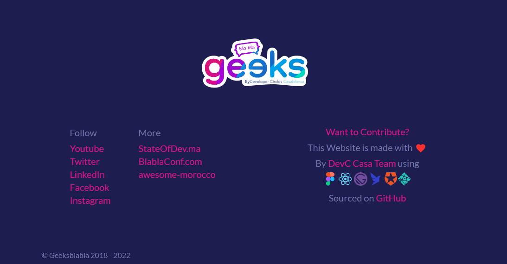

**Version Mobile:**
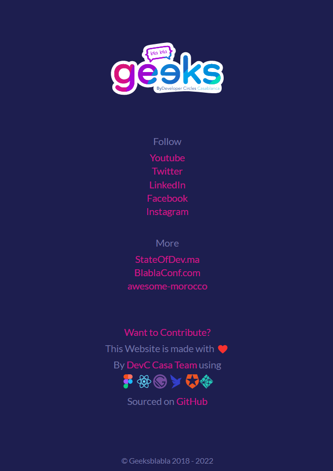

## Pull Request

Une fois mon travail terminé, il était donc nécessaire de créer une Pull Request afin de proposer mes modifications.

J'ai donc créer une pull request et pour ce faire il fallait donc dans un premier temps choisir deux branches, ici la branche master du dépôt d'origine et notre feature créée. Cela nous permet de voir ce qui a été modifié, de comparer les deux branches, et ainsi commencer une nouvelle demande de modification (pull request).
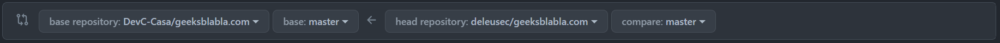

J'ai laissé le commentaire suivant afin de lister les changements effectués et de prévenir de certains problèmes rencontrés.
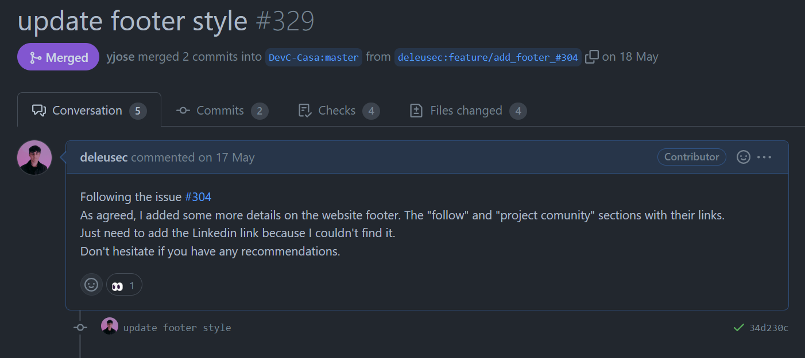

Ce à quoi le créateur m'a alors répondu la chose suivante
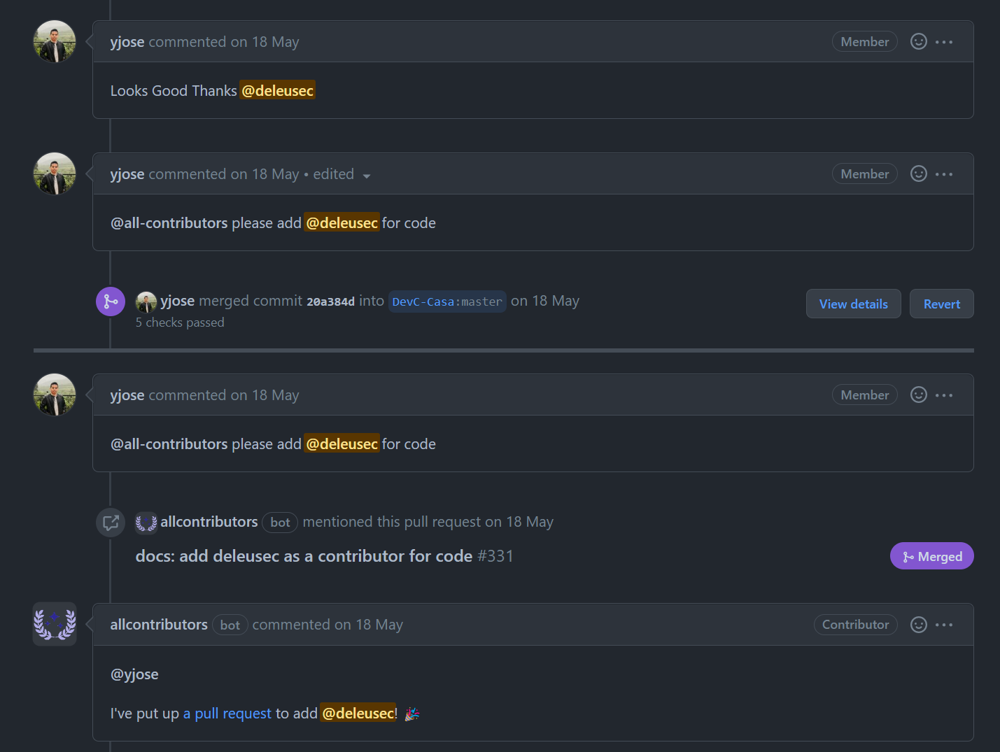

En effet, après quelques modifications de sa part pour ajouter les quelques informations qui me manquaient, il a alors accepté ma Pull Request et mon travail à été mergé sur le projet d'origine.
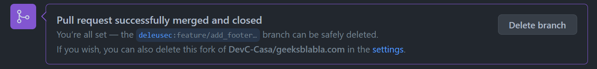

Et je suis également très content d'être à présent affiché parmi les collaborateurs du site.
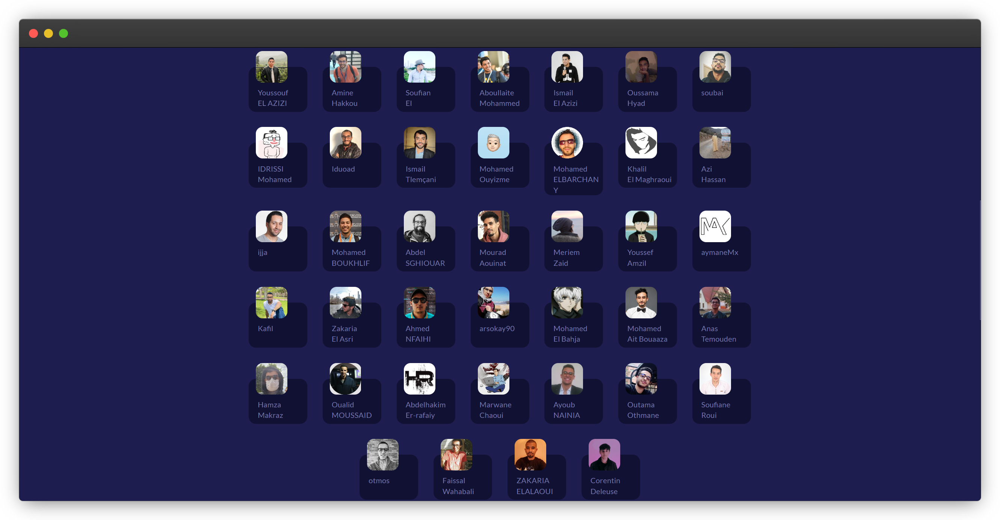
