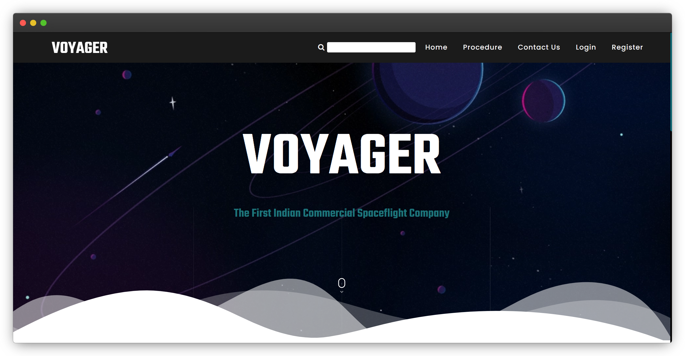
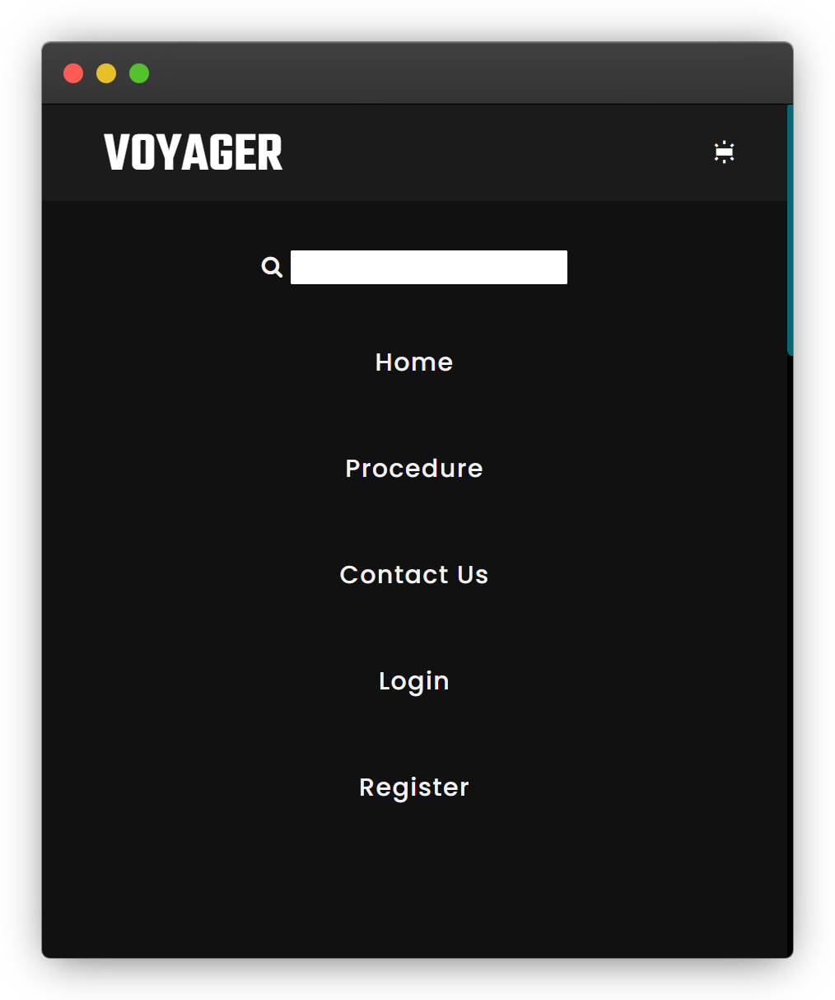
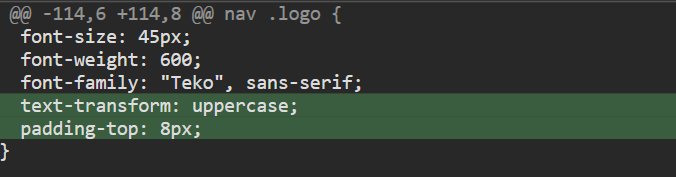
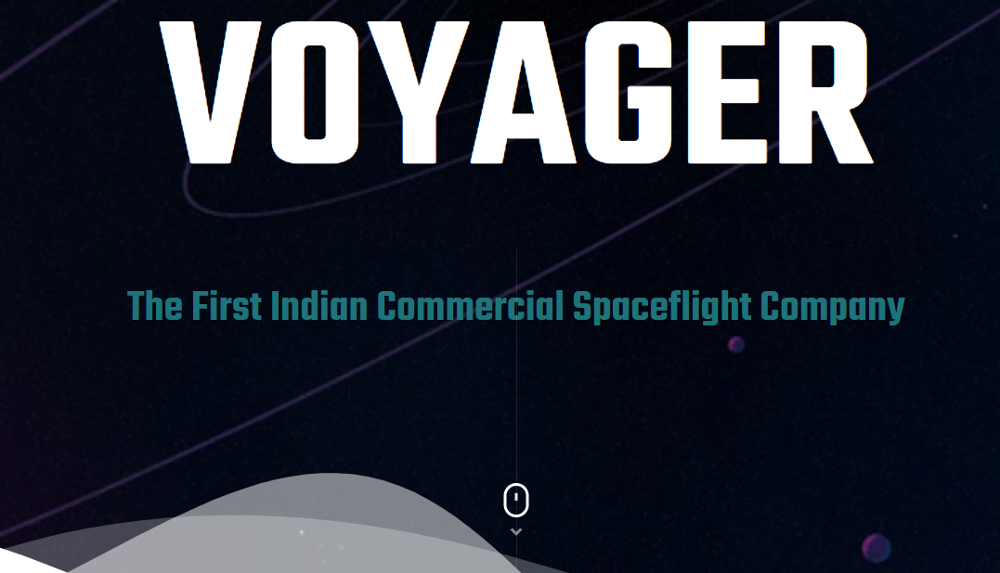
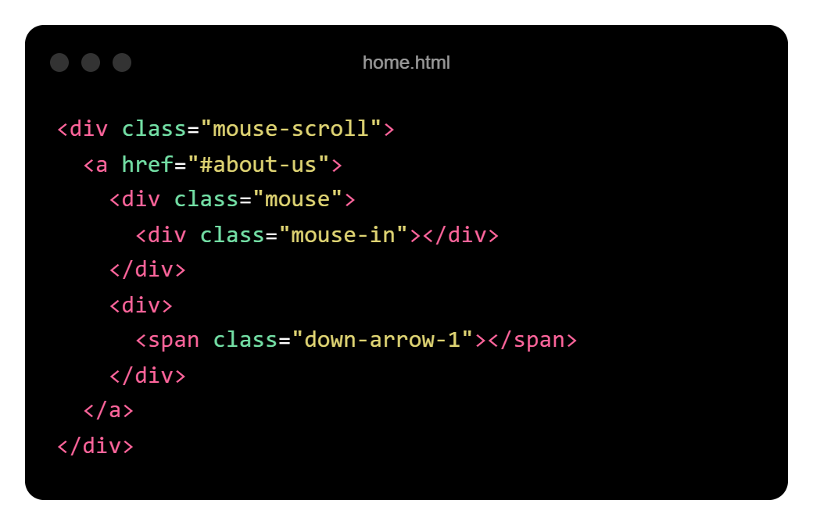
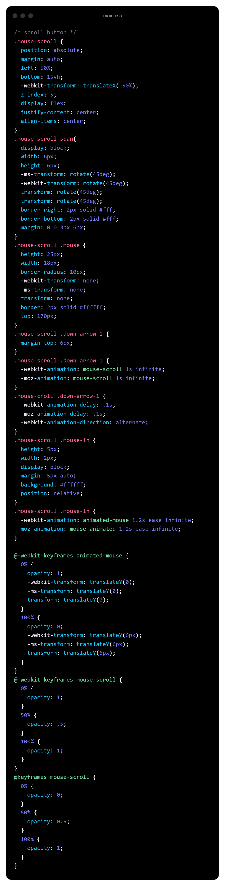
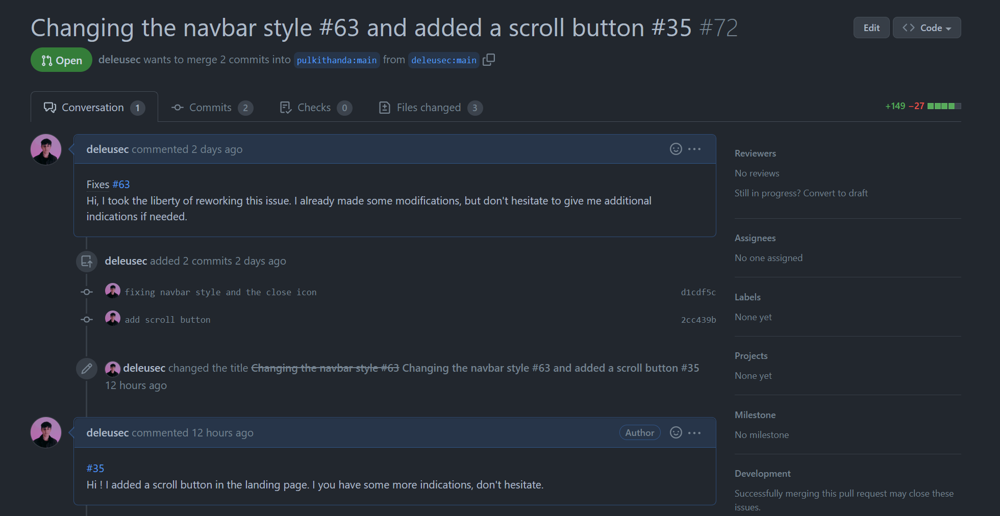

# Voyager 🚀

GitHub url : <https://github.com/pulkithanda/voyager-hf>

## Présentation du projet

Il s'agit d'un projet de développement web pour le hacktoberfest réalisé en HTML, CSS, JavaScript et Python.
C'est un site web sur l'espace qui peut être utilisé comme modèle à l'avenir pour les sujets liés à l'espace.

## Les issues traitées
J'ai contribué sur ce site web en résolvant 2 issues qui sont les suivantes.

### Première issue
**Changing the navbar style :**
<https://github.com/pulkithanda/voyager-hf/issues/63>

Il s'agit ici de quelques modifications et corrections dans la barre de navigation. 
En effet, on a dans un premier temps le style du logo qui n'est pas bon, il devrait être écrit tout en majuscule. 
Et dans un second temps, le bouton de fermeture du menu en mobile ne fonctionne pas correctement.

### Seconde issue
**Scroll button :**
<https://github.com/pulkithanda/voyager-hf/issues/35>

Sur cette issue, le créateur demande l'ajout d'un bouton de scroll sur la landing page qui permet d'indiquer à l'utilisateur qu'il doit scroller. 
Il permet également, quand on clique dessus, de scroller automatiquement la page à une ancre donnée.

## Mise en place du projet

Comme pour le projet précédent, j'ai donc commencé par réaliser un fork pour récupérer une copie du dépôt d'origine. 
On pourra alors cloner notre dépôt en local et installer ses dépendences. Le cas un peu particulié ici est que ce projet fonctionne avec python.
Il faudra alors lancer la commande suivante pour installer les dépendences `pip install -r requirements.txt`. Pip est l'installateur de paquets pour Python. 
Je n'avais encore jamais eu l'occasion de travailler avec le langage python, ce projet était donc intéressant car il m'a permis de découvrir un nouvel environnement de développement.
L'expérience de ce projet me permettra peut-être d'être plus à l'aise sur un potentiel futur projet qui utiliserait ces langages et outils.

Encore une fois, on retrouvera des instructions concernant la mise en place du projet et des règles de contributions dans le fichier `README.md`.

## Réalisations

### Première issue
J'ai donc réalisé quelques modifications dans le style du menu afin de répondre aux besoins. 
Voici le rendu final :

J'ai mis le texte "Voyager" en uppercase et j'ai également fait en sorte que l'icon du menu ne soit plus apparent lorsque le responsive menu est ouvert.
Voici ci-dessous en vert les modifications apportées au style du menu.

### Seconde issue
Pour cette seconde et dernière issue, il fallait donc mettre en place un bouton de scroll sur la landing page comme on peut le voir ci-dessous. 

J'ai d'abord dû ajouter dans le fichier `home.html` au niveau de la landing page les éléments suivants :

Pour ensuite modifier le style et créer des animations en css.

## Pull Request

Mon erreur aura été de ne pas initialiser le gitflow afin de créer une feature pour chaque issue traitée.
En effet, ayant commit mes modifications sur la même branche du dépôt, je me suis retrouvé dans l'impossibilité de faire une Pull Request pour chacune des issues. 
Voyant que le dépôt n'était composé que d'une seule branche main, je n'ai pas pensé bon d'initialiser un GitFlow, et donc par conséquent de créer une branche develop seulement pour mes petites modifications.
Mais je n'ai pas pensé au fait que la seule branche que l'auteur du projet aurait à comparer et à merger dans la branche main serait celle de ma feature.

J'ai donc dû créer une Pull Request pour les deux tickets en même temps, ce qu'y n'est pas une bonne pratique, mais cela me permettra de ne pas reproduire ce genre d'erreur à l'avenir. 

